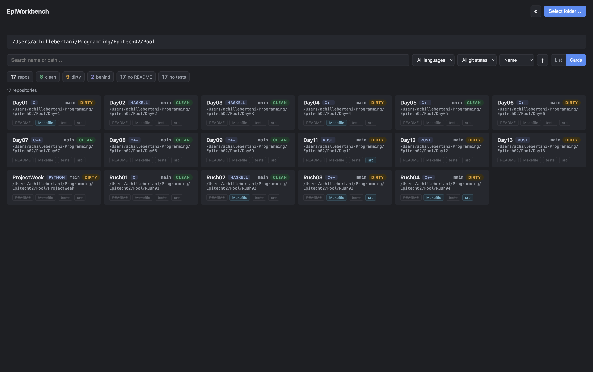
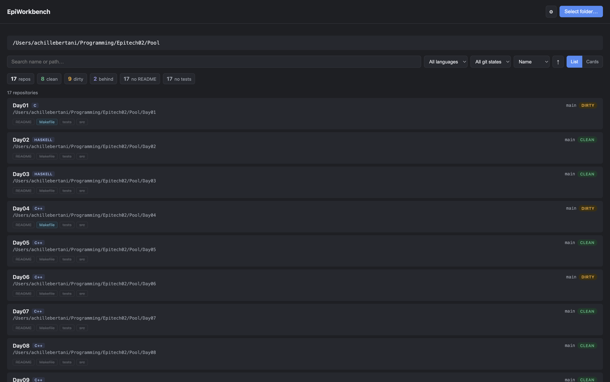
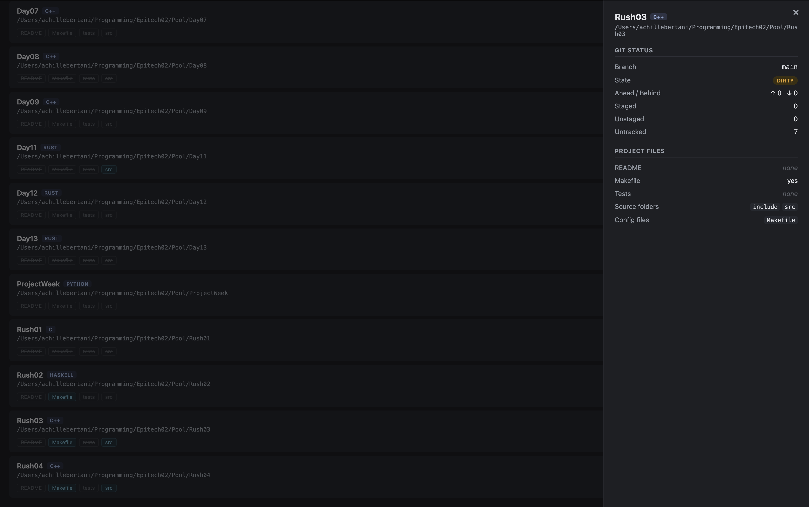

# EpiWorkbench

A local cross-platform desktop tool for Epitech students. Point it at a folder of projects and it scans every git repository inside, surfacing git status, key project files, and the detected language in one interface, so you can see the state of all your work at a glance.

## Screenshots







## Features

- **Folder scan:** pick a folder and EpiWorkbench finds every git repository inside, including multi-folder "pool"-style repos (it looks one level deep).
- **Git status per repo:** current branch, clean / dirty / no-upstream state, ahead-behind counts, and staged / unstaged / untracked file counts.
- **Project file detection:** flags README, Makefile, tests, source folders, and config files.
- **Language detection:** C, C++, Node, JavaScript, Python, Rust, Haskell, Groovy, Jinja, and Shell, plus Ansible detected by repository structure.
- **Search, filter, and sort:** search by name or path; filter by language and git state; sort by name, language, git state, or scan time.
- **Details dashboard:** click any repo for a full breakdown of its git status and detected files.
- **List and card views:** toggle between a compact list and a card grid, with a live result count.

## Tech stack

- [Electron](https://www.electronjs.org/) cross-platform desktop shell
- [TypeScript](https://www.typescriptlang.org/)
- [electron-vite](https://electron-vite.org/) build & dev tooling
- [simple-git](https://github.com/steveukx/git-js) git status
- Plain HTML + CSS for the UI (no framework)
- [Vitest](https://vitest.dev/), [ESLint](https://eslint.org/), [Prettier](https://prettier.io/) tests & code quality

## Requirements

- [Node.js](https://nodejs.org) v18 or later
- [Git](https://git-scm.com) installed and available in your PATH
- npm (comes with Node.js)

## Setup

```bash
npm install
node node_modules/electron/install.js
```

The second command downloads the Electron binary. It only needs to be run once after cloning.

## Run

```bash
npm run dev
```

> **VS Code terminal only:** the integrated terminal sets an environment variable that breaks Electron. Use this instead:
>
> ```bash
> env -u ELECTRON_RUN_AS_NODE npm run dev
> ```

## Build

```bash
npm run build
```

Compiled output goes into `out/`.

## Package

Produce a distributable application for the current platform:

```bash
npm run package       # full installer (.dmg / .nsis / .AppImage)
npm run package:dir   # unpacked app bundle only (faster, for testing)
```

Output goes into `release/`. Builds target the OS you run the command on (macOS → dmg, Windows → nsis, Linux → AppImage). The macOS build is unsigned (no Apple Developer certificate configured).

## Quality checks

```bash
npm run typecheck   # TypeScript, no emit
npm test            # Vitest unit tests (filters + language detection)
npm run lint        # ESLint
npm run format      # Prettier (write); use format:check to verify only
```
